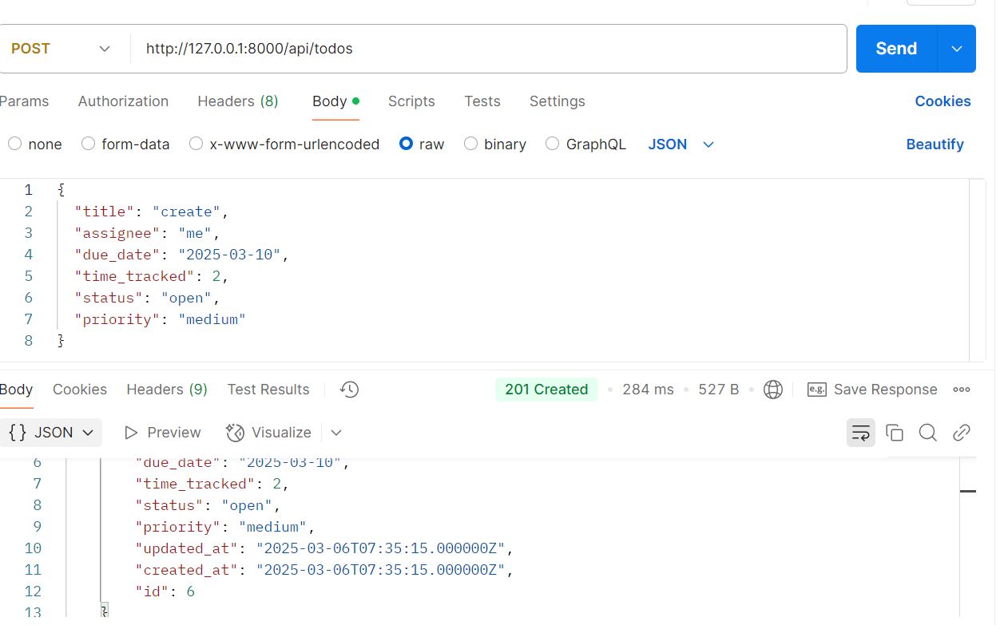
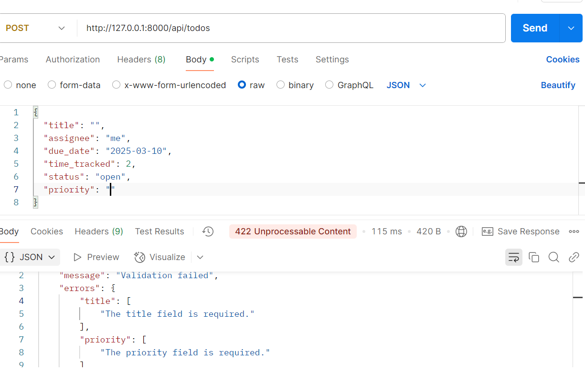
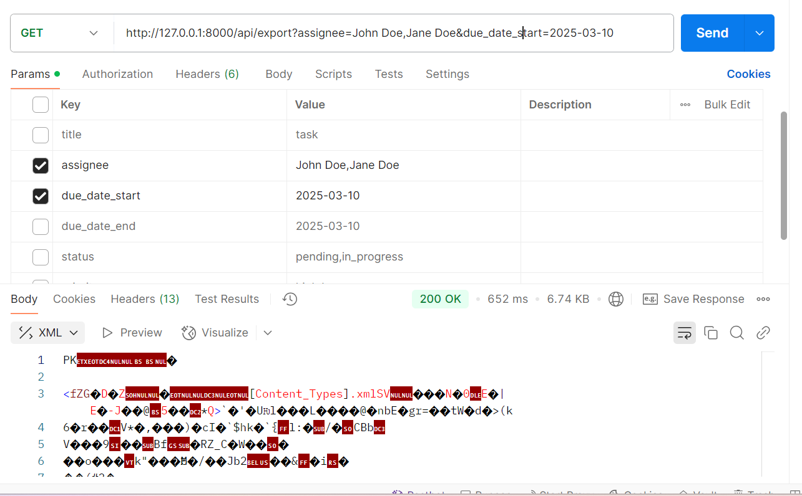
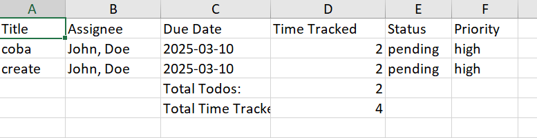
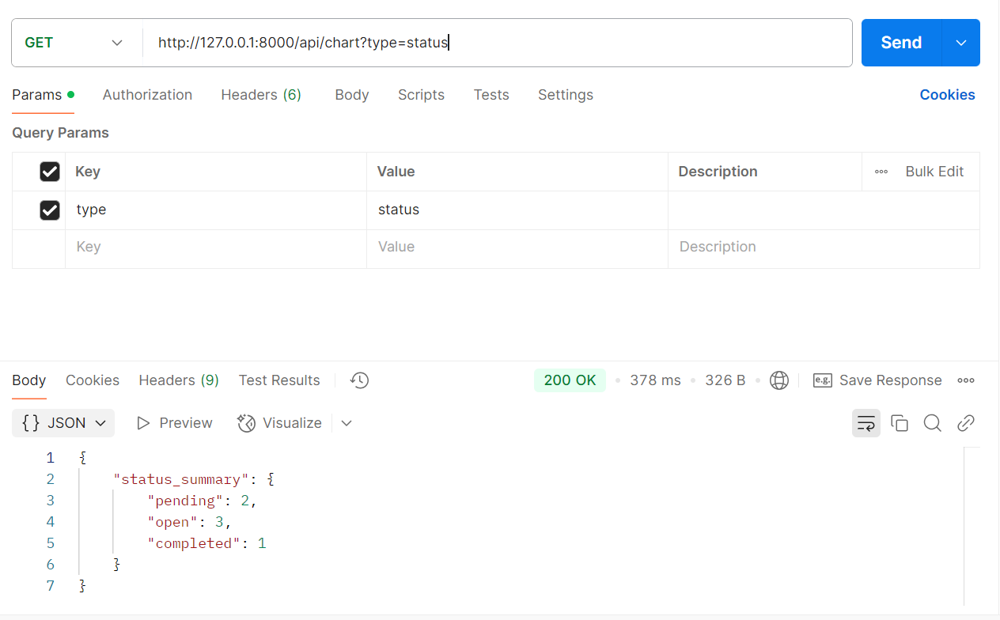
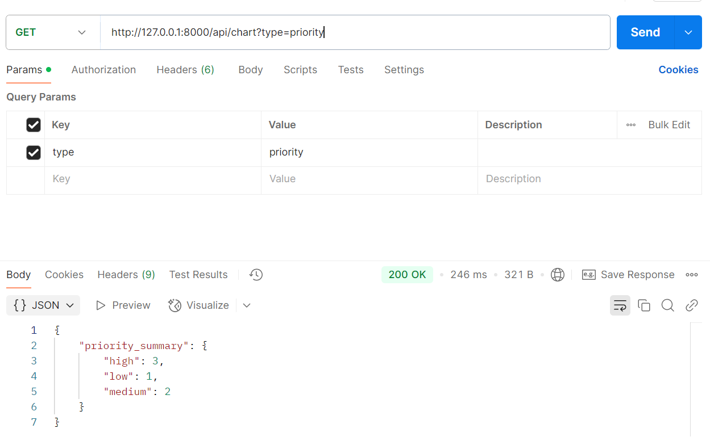
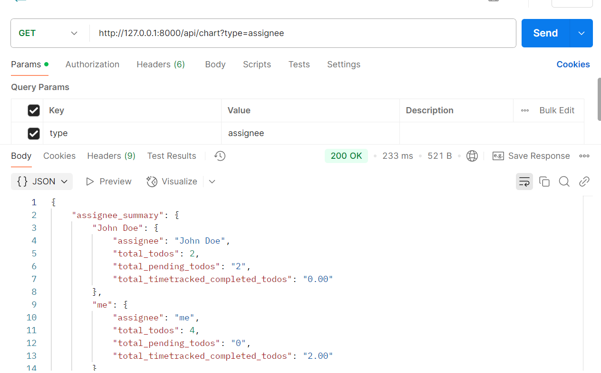

# Memulai Proyek

## Instalasi

Clone repo:

```bash
git clone https://github.com/ilhamdika/to-do-list.git
```

## Instal Dependensi

```bash
cd to-do-list
composer install
```

## Pengaturan Lingkungan

```bash
cp .env.example .env
php artisan key:generate
```

## Konfigurasi Database

Edit file `.env` untuk mengatur database:

```plaintext
DB_DATABASE=nama_database
DB_USERNAME=user_database
DB_PASSWORD=password_database
```

Jalankan migrasi:

```bash
php artisan migrate
```

## Menjalankan Aplikasi

```bash
php artisan serve
```

Akses aplikasi di `http://127.0.0.1:8000`.

## Hasil running di postman

dan untuk link postman bisa lihat di bawah ini:
[Postman](https://documenter.getpostman.com/view/26658030/2sAYdmkT6t)

## Berikut adalah listnya

### 1️ API Create Todo List



dan jika ada field yang tidak lolos validasi maka akan seperti ini:



### 2 API Get Todo List Generate Exel Report


Note: untuk menjalankan ini lebih baik di taruh di browser saja biar downloadnya langsung

dan untuk hasil exelnya setelah dibuka akan seperti ini


### 3. API Get Todo List to Provide Chart Data

dan ini adalah untuk type status


ini untuk type priority


ini untuk type assignee

